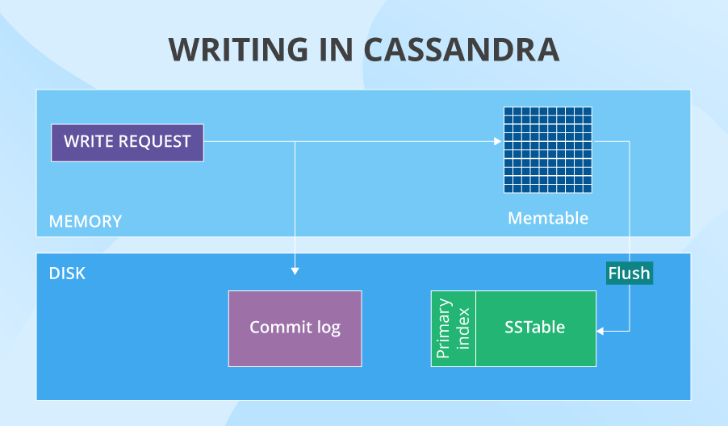

# Terms

**Token**: cluster의 모든 node들에 할당되는 대략적인 숫자, 모든 node들은 **token ring**을 형성함

**Partitioner**: cluster 내의 어떤 node들이 data를 저장하게 될 지를 결정하는 알고리즘

**Replication factor**: data 복사본의 갯수

**Keyspace**: 한 app의 모든 column family들을 저장하는 광역저장소

**Column family**: column들의 집합

**Column**: key(column 이름)와 value, timestamp로 이루어진 데이터가 저장되는 가장 작은 단위

**Memtable**: cache memory structure

**SSTable**: memtable이 disk로 flush되자마자 만들어지는 unchangeable data structure

**Primary index**: 해당 table의 row keys와 SSTable 내의 keys’ location로 가는 points의 집합, sstable의 한 부분

**Primary key**: 하나의 **partition key**와 여러 개의 **clustering columns**로 이루어짐

**Bloom filters**: 어떤 SSTable들이 필요한 데이터를 갖는지 빠르게 찾는 data structure

**Secondary index**: primary key가 아닌 column으로 데이터를 하나의 노드에 저장할 수 있음

**SATI**(SSTable Attached Secondary Index): sstable에 붙어있는 secondary index의 발전된 버전

**Materialized view**: 기본 table의 변형 table을 생성하면서 partition key에 queried column을 포함하는 cluster-wide indexing(secondary index는 제외), 모든 노드를 탐색하지 않고도 indexed data 탐색을 가능하게 함

**Gossip**: 한 cluster 내부의 node들 간의 내부 통신 protocol, peer-to-peer communication protocol, 매 초마다 최대 3개의 node와 통신하며 상태 메세지 교환, TCP 3-way handshake와 비슷

​	

- **SYN**: round of gossip을 시작하는 node(=initiator)가 peer node들에게 보내는 메세지, cluster 내 node들의 ip, generation, heartbeat version 내용 포함
- **ACK**: SYN 받은 node가 본인의 metadata 정보와 SYN 내의 내용 비교해서 initiator에게 보내는 메세지, 본인의 updated metadata 정보와 본인이 갖고있지 않은 digest of nodes 내용 포함
- **ACK2**: initiator가 각 node가 갖고있지 않은 metadata 정보를 peer node들에게 보내는 메세지, initiator는 ACK에서 받은 각 node의 metadata 정보로 본인의 metadata 정보 update하고, peer node들은 ACK2에서 받은 metadata 정보로 update

**Thrift**: 이진 통신 protocol

**Rack**: a grouped set of servers, 중복 데이터가 하나의 rack에 쌓이지 않고 여러 rack에 퍼지게 해서 한 rack이 down되는 경우를 대비, 한 datacenter 안에 여러 rack, 여러 server, 데이터가 하나의 rack에만 갈지 여러 rack에 갈지 결정하는 건 snitch

**Snitch**: 어떤 node가 어떤 datacenter의 어떤 rack에 있을지 결정

- SimpleSnitch: 근접성에 따라 결정, single-datacenter deployment의 경우 우선적으로 사용
- Dynamic Snitching: read latency 모니터해서 read가 느려지지 않도록
- RackInferringSnitch: 근접성을 각 노드 ip 주소의 2, 3번째 octet에 의해 결정, snitch class를 직접 custom할 때 사용

**Datacenter**: a group of nodes, datacenter가 하나인 경우, node type도 하나만 선택 가능

- transactional: standard
- datastax enterprise graph: graph DB
- datastax enterprise analytics: integration with apache spark
- datastax enterprise search: integration with apache solr
- datastax enterprise search analytics: search queries with analytics jobs

# Data Modeling

> 1. Disk space is cheap
> 2. Writes are cheap
> 3. Network communication is expensive

**SPREAD DATA EVENLY**

**REDUCE THE NUMBER OF PARTITION READS**

# Data partitionaing & Denormalization

### process

데이터를 분산시킬 때, Cassandra는 **consistent hashing**을 사용하면서 데이터 복제와 파티셔닝을 시행

##### data replication

data 입력  --> partitioner가 data의 primary key를 hash value로 변환(ex. 15) --> look up token ring --> hash value보다 큰 token을 가진 첫번째 node에 data 저장 --> replication factor에 맞게 남은 개수만큼 다른 node들(첫번째 node와 물리적으로 가까운 node들)에 저장

##### denormalization

하나의 table에 대한 여러가지 버전 생성 --> 다양한 read requests에 최적화

**consistent hashing**을 사용

##### data replication

1. data 입력
2. partitioner가 data의 primary key를 hash value로 변환(ex. 15)
3. look up token ring
4. hash value보다 큰 token을 가진 첫번째 node에 data 저장
5. replication factor에 맞게 남은 개수만큼 다른 node들(첫번째 node와 물리적으로 가까운 node들)에 저장

##### denormalization

하나의 table에 대한 여러가지 버전 생성 --> 다양한 read requests에 최적화

### downside

같은 내용 n번 반복해서 write --> write performance 나빠짐 (but 대체로 무시 가능한 정도)

### upside

token ring=possible keys의 배열, data는 token ring의 모든 node에 거의 고르게 분포돼있음

cluster performance는 **linearly scalable**: node 숫자를 2배하면 1. 각 token 간 거리가 반으로 -> read&write 2배 가까이 가능 2. fault-tolerant

# Write

### process

1. 특정 node에 도착
2. request --> commit log & data --> memtable
   1. write request가 **commit log**(in-cache writes에 대한 모든 정보 저장)로 전달
   2. data는 **memtable**에 저장
3. memtable이 꽉차서 더이상 data를 저장할 수 없는 경우
   1. flush from cache to disk: **SSTable**	
   2. commit log가 모든 data purge -> 해당 data를 cache에서 볼 필요 없어짐
4. operation이 성공적으로 끝났음을 coordinator node에 전달
   - 성공 전달 횟수는 설정된 **consistency level for writes**에 따라 달라짐

##### ✔️ node가 down됐을 경우 --> `hinted handoff`

1. coordinator가 response가 없는 replica node 확인 --> missed write 저장
2. 해당 node가 복구된 후 다시 write 상기시킬 hint를 local keyspace에 임시 생성
3. node가 3시간이 넘어서도 복구되지 않으면 coordinator가 해당 write 영구 저장

### downside

update command가 존재하긴 하지만 사실은 기존 entry와 동일한 primary key와 더 최신의 timestamp를 가진 새로운 entry가 생성됨 -> 모든 data를 다 찾아본 후 어떤 데이터가 가장 최신인지 cassandra가 판단해야함 --> read performance 나빠짐 & 이런 data 합치기 위한 압축 시행됨

### upside

random data input 막음 --> 명확한 write scenario --> write performance 좋아짐

hinted-handoff --> 모든 node들에 write가 가능하도록 (consistency level이 맞아야만 진행됨)

commit log --> node가 down되더라도 모든 lost in-cache writes 복구 가능

# Read

### process

1. data's partition key로 어떤 node가 data 갖고있는지 찾음
   1. request가 **consistency level for reads**에서 설정된 숫자만큼의 node에 전달됨
   2. 모든 node에서 data가 있을 수 있는 장소들을 정해진 순서대로 확인
      1. memtable
      2. row key cache (if enabled)
      3. bloom filter
      4. partition key cache (if enabled)
      5. (partition key cache에 없으면) partition summary --> primary index
      6. compression offsets --> SSTable에서 data fetch
   3. 가장 최근 timestamp 가진 data를 coordinator로 fetch

##### ✔️ data consistency issue --> `read repair process`

data replicas --> 최신 data 말고 옛날 data 읽을 수 있음 --> data consistency issue

1. 연관된 모든 node들은 결과 return
2. 모든 결과를 비교 --> *last write wins policy*
3. 최신 node는 사용자에게 return될 cadidate로 지정, 옛날 node들은 rewrite
4. consistency level보다 replication factor가 큰 경우
   1. 해당 data 갖는 나머지 node들의 결과 return
   2. 해당 node들 대상으로 비교 후 옛날 node들 rewrite
5. 사용자에게 결과 return

### downside

secondary index나 SASI같이 partition key가 아닌 column으로 조회하는 경우 performance 나빠짐

bloom filter: 확률에 기반한 알고리즘 --> 빠르지만 잘못된 결과 조회 가능성

secondary index, SASI, materialized view --> read뿐만 아니라 write에도 안좋음

- secondary index, SASI: data는 write할 때마다 indexed column까지 update
- materialized view: base table에 새로운게 write되면 materialized view 자체도 바뀌어야함	

cassandra는 partition size(100MB), number of values(2 billion)에 제한 있음 --> table에 column 너무 많거나 value가 너무 크면 조회 힘듦

### upside

steady data availability --> 실패할 지점이 한 군데도 없고, data를 다양한 node의 다양한 위치에 저장 --> cluster의 절반에 가까운 node들이 down돼도 replication factor만 잘 튜닝되어 있으면 read 가능

자주 조회되는 data에 대한 additional shortened read process 존재 

secondary index: analytical query나 거의 모든 node에 접근해야 하는 경우에 유용

SASI: full text search에 유용

# Conclusioin

### upside

1. distribute data efficiently
2. allow linear scalability
3. write data fast
4. provide almost constant data availability

### downside

1. data consistency issue
2. indexing is far from perfect
