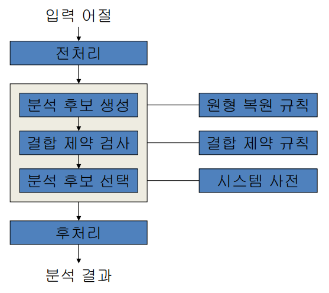
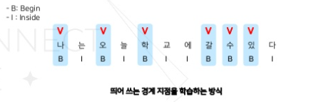
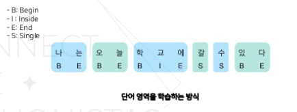
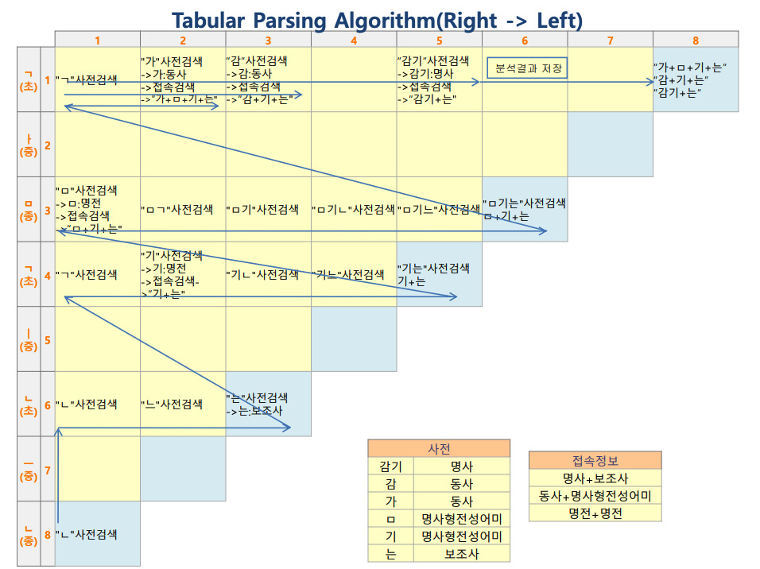
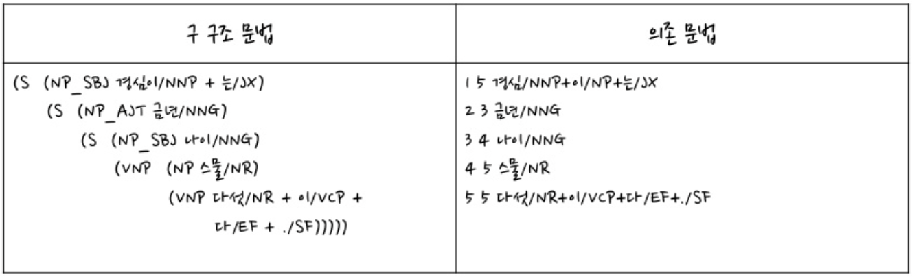
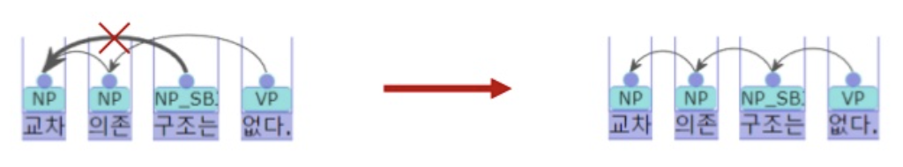
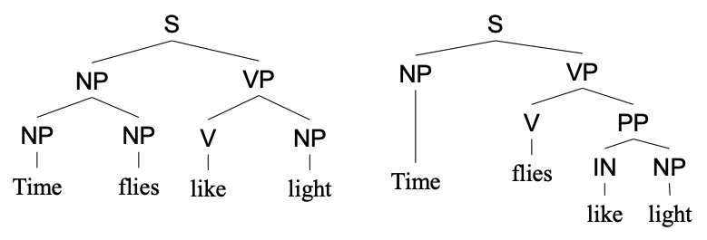

# 참고 자료

https://cs.kangwon.ac.kr/~leeck/NLP/05_morp.pdf

https://ebbnflow.tistory.com/246

https://searchall.tistory.com/attachment/cfile3.uf@11219D1C49ADE1156E7162.pdf

https://cs.kangwon.ac.kr/~leeck/NLP/01_intro.pdf

https://github.com/koalanlp/koalanlp

https://www.slideshare.net/ssuser760eb4/dependency-parser

# 형태소 분석

### 형태소 분석이란

**형태소**: 최소 의미(어휘적 의미 + 문법적 의미) 단위

- 자립성 여부
  - 자립 형태소: 자립 가능
    - 명사
    - 대명사
    - 수사
    - 관형사
    - 부사
    - 감탄사
  - 의존 형태소: 다른 형태소에 의존
    - 조사
    - 접사
    - 어미
    - 어간(어근)
- 의미 여부
  - 실질 형태소(어휘 형태소): 실질적인 의미를 가짐
    - 자립형태소
    - 어간(어근)
  - 형식 형태소(문법 형태소): 실질 형태소에 결합하여 말과 말 사이의 관계를 표시
    - 조사
    - 접사
    - 어미

**형태소 분석**: 어절 혹은 문장을 형태소로 분절하는 과정, 분리된 형태소의 기본형 및 품사 정보 추출

원문

> 나는 배가 아파서 걸어서 집에 갔습니다

형태소 분석

> 나(대명사)+는(보조사) 배(명사)+가(격조사) 아프(형용사)+아서(연결어미) 걷(동사)+어서(연결어미) 집(명사)+에(격조사) 가(동사)+았(선어말어미)+습니다(어말어미)

- 어휘 형태소: 나, 배, 아프, 걷, 집, 가
- 문법 형태소: 는, 가, 아서, 어서, 에, 았, 습니다

**형태소 분석의 중의성**: 기본 입력인 하나의 어절에 대해 여러 개의 형태소 분석 결과가 가능하다

> 나는 -> 1. 나(대명사)+는(보조사) 2. 나(동사)+는(관형형어미)

**품사 태깅(Part-Of-Speech tagging, POS tagging)**: 문맥을 고려하여 하나의 어절에 대해 가장 적합한 것으로 판단되는 하나의 형태를 도출

**형태소 분석기의 종류**

- 언어 특성에 따른 형태소 분석기
  - 띄어쓰기를 하지 않는 언어: 단어 분리가 중요 ex. 중국어, 일본어
  - 굴절어(단어의 형태 변화로 단어의 기능이 결정되는 언어): 형태소의 원형 복원 강조 ex. 영어, 핀란드어
  - 교착어(어근과 접사에 의해 단어의 기능이 결정되는 언어): 형태소 분리 문제가 중요 ex. 한국어
- 응용 분야에 따른 형태소 분석기
  - 기계 번역, 기계 이해 시스템: 분석의 정확성, 애매성 해결 강조
  - 자동 색인, 정보 검색: 명사(키워드) 추출, 복합명사나 미등록어 처리
  - 맞춤법 검사 및 교정: 오류어 분석 문제 중요

### 형태소 분석 과정

**입력**: 단어(어절)

**출력**: 단어를 이루는 형태소들의 기본형과 형태소의 품사, 문법적/관계적 의미를 나타내는 기호

1. **전처리**

   1. 문장으로부터 단어 추출

      1. 문장 분리

         1. 종결어미를 구분
         2. 문장의 CRF(Conditional Random Field) 결과로 판단

      2. 띄어쓰기

         1. 띄어쓰기 방식

            1. 경계 인식 방식: 띄어쓰기 전 토큰의 영향을 많이 받는다

               

            2. 영역 인식 방식: 띄어 쓰는 지점의 주변 토큰의 영향을 고르게 받는다

               

         2. 발생할 수 있는 문제, 해결방안

            1. 문맥 파악 없이는 잘못된 띄어쓰기의 가능성이 있다 -> 모든 공백 없앤 후, 문맥에 따라 띄어쓰기

   2. 문장 부호 분리

   3. 숫자, 특수 문자열 처리

      1. 반복되는 이모티콘, 자모음 정규화 ex. ㅋㅋㅋㅋ, ㅎㅎㅎㅎ, 하하하하

   4. 맞춤법 교정
2. **분석 후보 생성**

   1. 형태소 분리
      1. POS Tagging
   2. 불규칙 원형 복원(Stemming)
3. **결합 제약 검사**
   
   1. 모음 조화: 특정 부류의 모음끼리 붙는 현상 ex. 노랗다(O), 누렇다(O), 누랗다(X)
   2. 형태소 결합 제약
      1. 조사, 어미 사이의 결합 제약
      2. 체언, 조사
      3. 용언, 어미
      4. 인명, 조사
      5. 접미사
      6. 매개모음이 삽입되는 조사/어미
4. **옳은 후보 선택**
   1. 사전 탐색
   2. 단어 형성 규칙
5. **후처리**
   1. 복합명사 추정
   2. 사전 미등록어 처리
      1. 미등록어 추정 경험 규칙
         1. 세 개 이상의 형태소로 분리된 것
         2. 용언보다 체언으로 분석된 것 == 조사가 분리된 것
         3. 두 음절 이상의 어미가 분리된 것
         4. 어휘형태소 부분의 길이가 짧은 것
         5. 체언
   3. 준말처리

### 형태소 분석 방법론

1. Tabular 파싱법: bottom-up 방식, 동적 프로그래밍 기법 -> 처리 속도 향상
   1. 단어를 이루는 가능한 형태소 추출

   2. 자모 단위의 substring을 사전에서 검색

   3. 추출된 형태소를 삼각 테이블에 저장  

      

      하늘색 상자

      - 해당 초성/종성까지의 사전 검색 결과
      - 해당 초성/종성까지의 접속 검색 결과

2. 최장/최단 일치법: Tabular 파싱법의 효율 문제 해결, 우선 순위가 높은 형태소를 우선 분석, 한 가지 분석 결과만 필요할 때 사용

   1. 최장 일치법: 형태소의 길이가 긴 것 우선
   2. 최단 일치법: 형태소의 길이가 짧은 것 우선

3. 음절 단위 분석법: 알고리즘, 사전 탐색의 비효율성 문제 해결

   1. 문법 형태소 분리
      1. 음절 단위 분리
      2. 조사/어미의 음절 특성 이용
   2. 형태론적 변형
      1. 원형 복원법 사용
      2. 형태 변이가 일어난 음절의 특성 이용
   3. 복합 명사 및 미등록어 추정
   4. 특이한 언어 현상 ex. 불완전동사, 줄임말
      1. 기존 사전에 분석 결과 저장
   5. 음절 단위 비교 및 음절 단위 사전 구성

# 자연어 처리

자연어 처리: 자연어의 의미를 분석하여 컴퓨터가 처리할 수 있도록 하는 것

### 형태소 분석

입력된 문장을 형태소 단위로 분할하고 품사를 부착한다.

### 구문 분석

주어, 목적어, 서술어와 같은 구문 단위를 찾아 문장 구조를 파악한다.

결과로 반환된 단어들 간의 관계 구조는 트리 형식으로 나타낼 수 있다.

**구문**: 글(문장)이 짜여있는 구조

원문

> John ate the apple.

구문 분석

> <u>John</u>(N) <u>ate</u>(V) <u>the</u>(ART) <u>apple</u>(N).
>
> <u>John</u>(NP) <u>ate</u>(V) <u>the</u>(ART) <u>apple</u>(N).
>
> <u>John</u>(NP) <u>ate</u>(V) <u>the apple</u>(NP).
>
> <u>John</u>(NP) <u>ate the apple</u>(VP).
>
> <u>John ate the apple</u>(S).

**문법 모형**: 구조를 표현할 문법

- 구 구조 문법(Phrase structure grammar): 구를 구성하는 구조를 통해 정의
- 의존 문법(Dependency grammar): 의존관계를 통해 구조를 정의
  - 특징
    - 한국어와 같이 비교적 어순이 자유로운 언어에서는 의존 구문 분석 방법을 선호
    - 구문 분석의 복잡도를 줄이고, 문장 성분들의 지배 의존 관계를 파악할 수 있음
  - 요소
    - 지배소(Governor): 의미의 중심 ex. 나이
    - 의존소(Dependent): 지배소가 갖는 의미를 보완 ex. 금년

**한국어 구문 분석 기본 규칙**

1. 지배소 후위 언어: 지배소는 피지배소보다 항상 뒤에 위치

2. 교차 의존 구조는 없음

   

3. 각 어절의 지배소는 하나

**구조적 중의성**: 하나의 문장에 대해 여러 개의 구조 분석 결과가 가능하다.

### 의미 분석

문장이 의미적으로 올바른지 판단한다.

### 담화 분석

대화 흐름 상 어떤 의미를 가지는지 찾는다.

