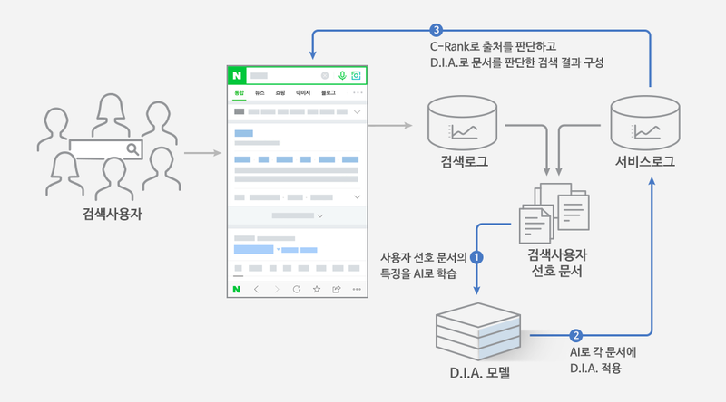
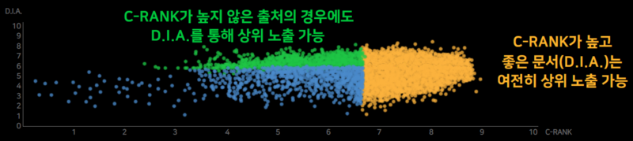

# 검색 트렌드

### 종합 검색

#### 네이버

https://datalab.naver.com/

기간, 기기(모바일, PC), 성별, 연령, 지역에 따라 세분화

1. **기간**: 검색어가 검색된 시간
2. 기기: 접속 경로에 따른 결과(PC 웹사이트, 모바일 웹사이트, 네이버 어플리케이션 등)로 추정
3. 성별: 로그인 되어있는 경우 네이버 자체 정보를 활용하는 것으로 추정
4. 연령: 로그인 되어있는 경우 네이버 자체 정보를 활용하는 것으로 추정
5. **지역**: IP주소 혹은 요청한 기기의 위치 정보를 활용하는 것으로 추정

- 조회기간 내 최대 관심도를 100으로 하여 **상대적인 변화**를 나타냄

#### 구글

https://trends.google.co.kr/trends/?geo=KR

1. **기간**: 검색어가 검색된 시간
2. **지역**: IP주소 혹은 요청한 기기의 위치 정보를 활용하는 것으로 추정
3. 관련 주제: 해당 검색어를 검색한 사용자가 검색한 다른 검색어의 주제(대분류)
4. 관련 검색어: 해당 검색어를 검색한 사용자가 검색한 다른 검색어
5. 검색 종류: 웹 검색, 이미지 검색, 뉴스 검색, 쇼핑, 유튜브 등 검색한 곳

- 인기: 상대적인 **검색 빈도**에 따른 점수
- 급상승: 지난 기간 이후 **검색 빈도**가 가장 많이 증가한 검색어

#### 공통점

1. 기간, 지역에 따라 통계 지표를 세분화하여 볼 수 있음
2. 지표는 절대적인 값이 아닌 상대적인 값
3. 검색어를 대분류로 묶어서 단순 검색어 뿐만 아니라 대분류 별 비교까지

#### 결론

1. 네이버는 '데이터'에 집중하고, 구글은 '검색'에 집중한 느낌이 강했다
2. 사이트의 방향성, 예상 사용자 등을 따라 분석의 형태, 필터링 등등도 다양하게

### 게임

#### 인벤

http://www.inven.co.kr/webzine/news/?news=252660 : 별도의 트렌드 분석 탭 없이 매주 순위 산정 후 분석글 작성

PC방 이용률, 인벤 내 사용자 투표, 기사 반응도, 커뮤니티 반응 등 취합

# 인기도 모델

## 네이버

### 1. LIBRA

#### 로직

45일 간 매일 글을 작성하고, 글에 댓글, 스크랩수가 많으면 상위 노출

#### 단점

어뷰징

### 2. C-RANK

#### 로직

여러 카테고리에 대해 글을 작성하는 블로거보다 하나의 카테고리에 대해 오랫동안, 전문적으로 글을 작성한 블로거를 상위 노출

Context - 주제별 관심사 집중도

Content - 생산되는 정보의 품질

Chain - 생산된 콘텐츠가 어떤 연쇄반응을 보여 소비/생산되는지

-> Creator - 위 세 가지를 통해 해당 블로그가 얼마나 믿을 수 있고 인기가 있는지 계산

#### 단점

특정 블로거에게 광고 집중 -> 상업화

### 3. D.I.A

#### 로직

네이버 데이터를 기반으로 키워드 별 사용자들이 선호하는 문서에 대한 점수를 랭킹에 반영

문저의 주제 적합도, 경험 정보, 정보의 충실성, 문서의 의도, 상대적인 어뷰징 척도, 독창성, 적시성 등 반영

### 현재

C-RANK와 D.I.A 함께 사용

## 구글

### Panda

#### 로직

1. 향상
   1. 뉴스 사이트
2. 페널티
   1. 광고, 제휴사 링크가 과하게 많이 포함된 낮은 품질의 콘텐츠
   2. 무분별한 키워드 남용
   3. 저조한 UX
   4. 블랙햇 전략: 부적절한 방법으로 노출 순위를 높임

### Penguin

#### 로직

링크 품질 기준 강화

1. 페널티
   1. 제3자에게 백링크를 구입한 웹사이트

### Hummingbird

#### 로직

검색자의 의도 파악

1. 향상
   1.  사이트가 정확한 검색 단어를 갖고 있지 않아도 순위에 포함되도록
2. 페널티
   1. 무분별한 키워드 남용
   2. 저질 콘텐츠

### Pigeon

#### 로직

검색자의 위치 등의 지리적 요인 고려하여 적절하고 정확한 결과 제공

1. 페널티
   1. 적절하지 않은 on-page, off-page
      1. on-page: 직접 최적화할 수 있는 부분 -> 어떤 검색어에서 노출될지 결정
      2. off-page: 콘텐츠 생성, 다른 웹사이트에서 백링크 얻기 등을 통해 도메인 파워 강화? -> 검색 결과 내에서 몇 번째 순위인지 결정

### Rank-Brain

#### 로직

AI 알고리즘

1. 향상
   1. 검색자의 의도 파악 과정
2. 페널티
   1. 얕은 지식
   2. 표절했거나 관련된 검색 쿼리에 거의 가치를 더하지 않은 콘텐츠
   3. 스팸
   4. 무분별한 키워드 남용

### Possum

#### 로직

로컬 SEO 변화

1. 향상
   1. 검색자의 위치에 따른 결과
2. 페널티
   1. 하나의 NAP(Name, Address, Phone number)에 여러 지점이 있는 회사

### Fred

#### 로직

전문성, 권위성, 신뢰성 바탕으로 랭킹 점수 조정