## 자동 완성

#### 언어 모델(Language Model)

단어 시퀀스에 확률을 할당하는 모델

보편적으로 이전 단어들이 주어졌을 때 다음 단어를 예측하여 확률을 할당

1. **단어 시퀀스의 확률**

   하나의 단어를 w, 단어 시퀀스를 W라고 할 때, n개의 단어가 등장하는 단어 시퀀스 W의 확률 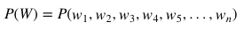

2. **다음 단어 등장 확률**

   n-1개의 단어가 나열된 상태에서 n번째 단어의 확률 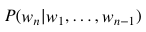

   전체 단어 시퀀스 W의 확률 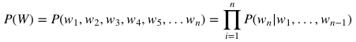

3. **조건부 확률의 연쇄 법칙(chain rule)** 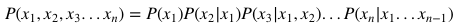

#### 통계적 언어 모델(SLM, Statistical Language Model)

1. **문장에 대한 확률**

   An adorable little boy is spreading smiles

   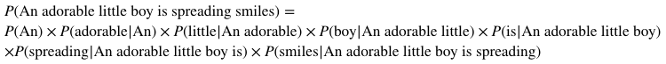

2. **카운트 기반 접근**

   기계가 학습한 코퍼스 데이터에서 등장한 횟수를 카운트해 확률을 계산

   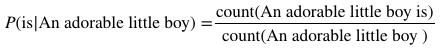

3. **희소 문제(Sparsity Problem)**

   충분한 데이터를 관측하지 못해 언어를 정확히 모델링하지 못하는 문제

   n-gram, 스무딩, 백오프 등 일반화 기법이 존재하지만 근본적인 해결책은 되지 못함

   SLM에서 인공신경망 언어 모델로 넘어가게 되는 계기

#### n-gram

SLM의 일종으로, 이전에 등장한 모든 단어를 고려하지 않고 일부 단어만 고려하는 접근 방법

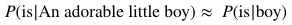

n개의 연속적인 단어 나열, n개의 단어 뭉치 단위로 끊어 하나의 토큰으로 간주

- unigram: an, adorable, little, boy, is, spreading, smiles
- bigram: an adorable, adorable little, little boy, boy is, is spreading, spreading smiles
- tribram: an adorable little, adorable little boy, little boy is, boy is spreading, is spreading smiles
- 4-gram: an adorable little boy, adorable little boy is, little boy is spreading, boy is spreading smiles

다음에 나올 단어는 오직 n-1개의 단어에만 의존하여 예측

- 4-gram: spreading 다음 단어를 예측할 경우 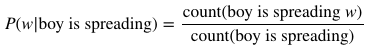

  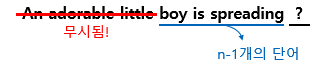

적용 분야에 맞는 코퍼스를 수집하는 것이 중요

전체 단어를 반영하지 않기 때문에 문맥을 파악하지 못하는 문제 발생 가능

#### feature representation

대상을 **속성**들로 표현하는 방식

자연어 처리의 경우 단어 자체의 의미, 품사, 문장 내 위치 등의 언어적 정보가 속성이 됨

1. **sparse representation**

   해당 속성이 가질 수 있는 모든 경우의 수를 각각의 독립적인 차원으로 표현

   one-hot encoding

   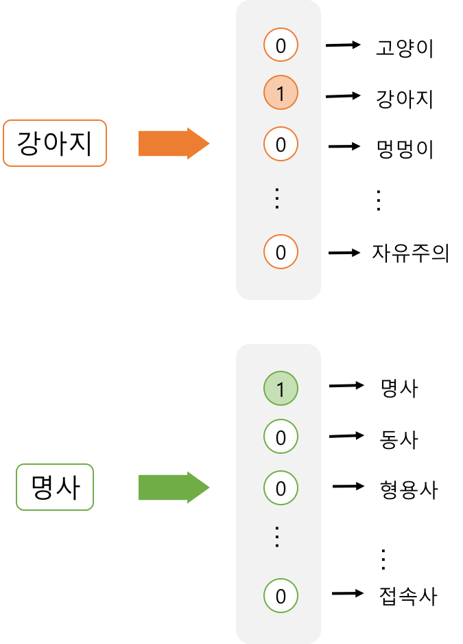

2. **dense representation**

   word embedding: 사전에 정한 개수의 차원으로 대상을 대응시켜 표현, 머신 러닝을 통해 학습

   하나의 차원이 하나의 속성을 명시적으로 표현하는 것이 아닌, 여러 차원들이 조합되어 나타내고자 하는 속성들을 표현

   Word2Vec

   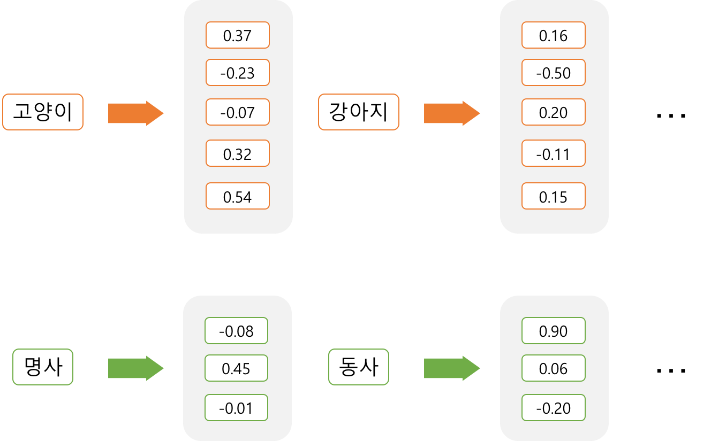

#### one-hot encoding

모든 단어에 번호를 매기고 해당하는 요소만 1, 나머지는 0을 갖는 벡터

N개의 단어가 있을 때, 각 단어는 한 개의 요소만 1인 N차원 벡터로 표현 가능

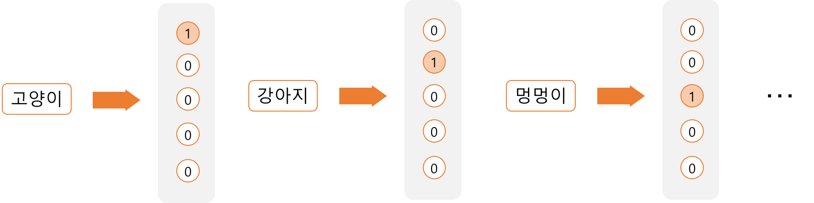

**단점**

1. 단어의 수가 늘어날수록 벡터의 차원도 증가 -> 효율성이 떨어짐
2. 단어와 단어 간 관계가 드러나지 않는다는 단점 -> 유사한 의미의 단어도 전혀 다른 벡터로 표현

#### Word2Vec

주변 단어를 통해 특정 부분에 적합한 단어를 판단

비지도 학습(unsupervised learning) 알고리즘: 단어 간 유사도 등을 사람이 알려주지 않아도 word2vec가 찾아냄

#### skip-gram

중심 단어를 통해 주변 단어를 예측하는 Word2Vec 모델

**한국어 자모 단위 skip-gram**

- https://www.aclweb.org/anthology/P18-1226.pdf
- 4.2.1, 4.2.2에서 유사도 테스트, 단어 유추 테스트 진행
- 글자 단위보다 자모 단위에서 정확도가 더 높았다

### 연관검색어

연관검색어 비교: https://kosim.koar.kr/v.30/2/297/673

 