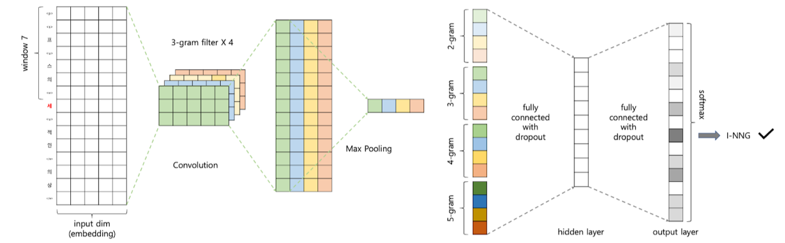
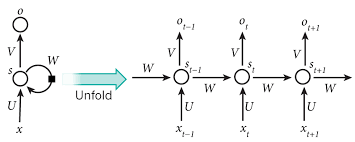
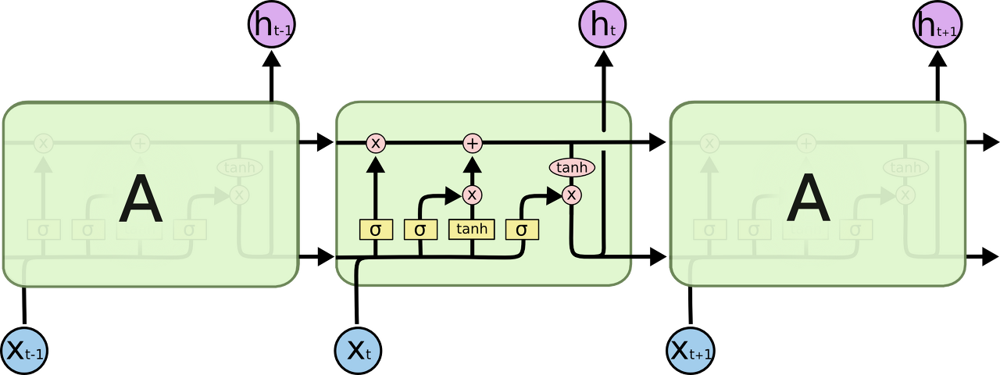
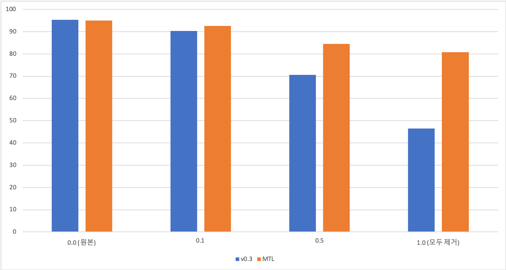
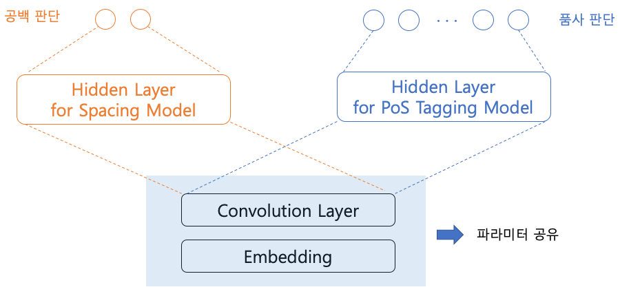

## khaiii

Kakao Hangul Analyzer III

사전이나 규칙에 기반한 기존 형태소 분석기와 달리 데이터/기계 학습 기반 알고리즘을 이용해 분석

#### 알고리즘

**CNN 사용**

- CNN(Convolutional Neural Network)

  

  - 주로 computer vision 분야에서 활용
  - NLP에서는 분류 문제에 적합 ex. 감정 분석, 스팸 탐지, 주제 분류
    - CNN을 활용한 문장 분류 - https://www.aclweb.org/anthology/D14-1181.pdf 
      - khaiii 네트워크 구조 형성 시 참고한 논문
      - 문장->문맥, 단어->음절 로 적용
  - POS Tagging의 경우에는 순서가 중요하기 때문에 CNN보다는 RNN이 적합해 보인다 -> CNN도 지역 특징을 input에 추가하면 가능
    - CNN에서 깊은 네트워크 형성하여 POS Tagging - http://proceedings.mlr.press/v32/santos14.pdf

- RNN(Recurrent Neural Network)

  

  - 출력 결과는 이전의 계산 결과에 영향을 받음 -> 순차적으로 정보 처리
  - 인간이 문장을 받아들이는 과정(왼->오 또는 오->왼 으로 순서를 가짐)과 흡사하게 진행됨 -> 자연어 저리에 CNN보다 적합하다고 판단
  - hidden vector들이 각각 독립적으로 존재하지 않고 서로 관계를 가짐 -> feed forward, back propagation 시 시간 소요

- LSTM(Long-Short Term Memory)

  

  - RNN에서 문장이 길어질 때 발생하는 긴 기간의 의존성(long-term dependencies) 문제 해결
  - sigmoid layer를 통해 이전의 정보를 넘겨줄지 버릴지 판단
  - RNN에서 파생됐기 때문에 RNN과 동일하게 hidden vector 사이의 관계 형성 때문에 feed forward, back propagation 시 시간 소요

- 왜 CNN을 사용했을까?

  - 형태소 분석은 자연어 처리의 첫 단계 -> 속도가 관건이라고 판단
  - 합성곱 자체가 컴퓨터 그래픽의 핵심이기 때문에 GPU 단계에서 잘 동작 -> 매우 빠름
  - convolutional filter는 전체 단어 사전 없이도 좋은 단어 표현 학습
  - 필터의 크기가 5보다 크더라도 문제가 되지 않음 (vs. n-gram의 경우 n>=3이면 비용이 급격히 증가)

**공백 dropout 사용** (v0.4)

- dropout

  

  - 임의의 neuron들을 선택해 해당 layer의 결과를 무시
  - overfitting 방지
    - 특정 input에 존재하는 요소들이 모든 input에 존재하는 것은 아님
    - 임의로 선택된 결과를 반영하지 않으면서 해당 layer들에 over-reliance하는 문제 방지 가능

- 공백 dropout

  

  - 띄어쓰기가 잘못된 어절의 경계에 <w>, </w> 의 가상 음절 임베딩을 elementwise로 추가
  - 가상 음절 임베딩을 일정 확률로 추가하지 않도록 학습
  - 디코더에서는 사용자의 입력에 따라 공백 음절을 항상 사용하도록

- 왜 공백 dropout을 도입했을까?

  

  - 공백을 없앨 때마다 v0.3(공백 dropout을 사용하지 않은 모델)보다 MTL(=v0.4, 기존 v0.3 + 공백 dropout)이 더 완만하게 정확도가 감소
  - v0.3이 띄어쓰기가 완벽하게 되어 있는 세종 코퍼스에 overfitting 되어 있다고 볼 수 있음
  - 최근 사용자들(특히 모바일)은 띄어쓰기를 지키지 않는 경우가 많으므로 일반적으로 MTL이 더 좋은 성능을 보일 것이라 기대

**multi-task learning**

각 음절마다 품사를 판단하는 기존 모델 + 공백 dropout을 통해 공백을 판단하는 모델

임베딩, convolution layer 부분은 파라미터 공유, downsteam task 부분에 해당하는 hidden layer는 분리

- downstream task: pre-trained model, component를 사용하는 supervised-learning task
- downstream task가 분리되어 진행되기 때문에 모델이 추가되어도 inference에 변화 X

#### 음절 기반 모델

왜 음절 기반으로 했을까?

- 한국어는 원형 복원, 불규칙 활용 등의 이유로 입력과는 형태와 길이가 다른 경우가 많음

- 음절에서 분리된 형태소를 정렬하고, 태그로부터 다시 원형을 복원

  

  - 단순 태그: 한 음절에서 여러 형태소로 분리되지 않은 경우 한 음절이 하나의 태그만 가짐
  - 복합 태그: 한 음절에서 여러 형태소로 분리된 경우 한 음절이 여러 개의 태그를 가짐
  - 태그는 IOB1 방식으로 표현 - https://www.aclweb.org/anthology/E99-1023.pdf
    - khaiii 품사 태깅 시 참고한 논문
  - 음절 단위 한국어 품사 태깅에서 원형 복원 - http://kiise.or.kr/e_journal/2013/3/SA/pdf/06.pdf
    - khaiii 음절 원형 복원 시 참고한 논문

#### 하이퍼 파라미터

- win: 음절의 좌/우 문맥 크기, 3 혹은 4에서 가장 좋은 성능
- emb = {20, 30, 40, 50, 70, 100, 150, 200, 300, 500}: 음절 임베딩 차원, 150까지는 성능이 비례해서 높아지다가 그 이상에서는 유의미한 차이를 보이지 않음

#### 성능 지표

- F-Score: 정확률과 재현율의 조화 평균값

  - 조화 평균(harmonic mean): 역수의 차원에서 평균을 구하고, 다시 역수를 취해 원래 차원으로 돌아오는 것
    $$
    x = \frac{2ab}{a+b}
    $$

  - F-Score

    

    - 정확률: 예측 Positive 중 True의 비율 
      $$
      \frac{TP}{FP+TP}
      $$
      

    

    - 재현율: 실제 Positive 중 True의 비율
      $$
      \frac{TP}{FN+TP}
      $$
      

    - F-Score
      $$
      \frac{TP}{\frac{1}{2}(FP+FN)+TP}
      $$

    - F-Score를 사용하는 이유: 일반적인 정확도 계산과 달리 각 클래스의 불균형이나 FP, FN 등이 고려됨