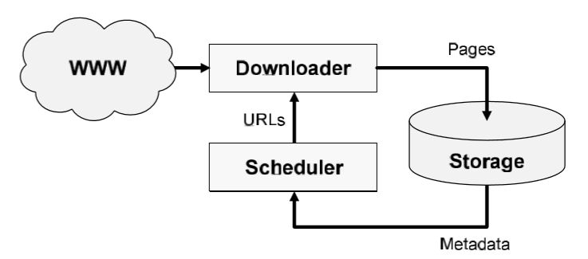
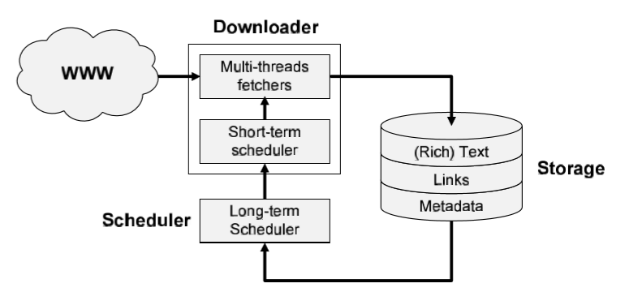

## 웹 크롤러

웹 크롤러는 master/slave 모델을 따르며, master(frontier), slave(agent), monitor 세 가지 컴포넌트로 이루어져 있다.

- master(frontier): 서버 역할, agent가 수집한 url을 전송받아 관리하고, 필터링된 url을 다시 agent로 분배한다.
- slave(agent): frontier로부터 url을 전송받아 해당 url의 웹페이지(html)을 처리한다. 웹페이지 처리 결과로 다른 웹페이지에 대한 url link와 이미지 등의 리소스 url link를 추출한다. 추출된 모든 url 링크는 frontier로 전송한다.
- monitor: frontier와 agent의 동작 상태를 모니터링하고 제어 기능을 포함한다.

#### 구성 모듈

- **스케줄러(프론티어)**: 방문할 url의 큐를 유지하고, 하나 또는 그 이상의 다운로더를 특정 순서로 큐에서 순서대로 나오는 url에 보낸다.
- 다운로더: 각 url에 해당하는 내용을 검색해서 구문 분석 후 저장소 모듈에 보내며, 나중에 색인화되고 검색한다.
- 저장소: 해당 페이지에서 검색된 메타데이터를 스케쥴러에 제공, 메타데이터는 스케쥴링 정책을 구동시키는 데에 중요한 정보가 된다.

스케줄링

- 장기 스케줄링: 품질과 신선도 평가에 따라 다음 방문할 페이지를 결정
  - 시간 간격: 몇 시간 혹은 며칠
- 단기 스케줄링: 공손도 정책 혹은 네트워크 사용 최적화에 따라 페이지를 재배정
  - 시간 간격: 몇 초 혹은 몇 분
  - 공손도 정책: 
- 시간 간격은 수집기에 설정된 대기 시간에 의존한다.

