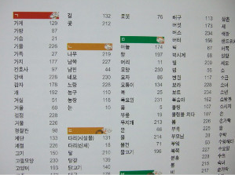

### 검색 엔진

구글: https://developers.google.com/search?hl=ko

네이버: https://searchadvisor.naver.com/

------

#### 참고사이트

https://ingeniouslab.co.kr/how-search-engines-work/

[https://improveyourank.com/%EA%B5%AC%EA%B8%80-%EA%B2%80%EC%83%89-%EC%95%8C%EA%B3%A0%EB%A6%AC%EC%A6%98%EC%9D%80-%EB%AC%B4%EC%97%87%EC%9D%BC%EA%B9%8C/](https://improveyourank.com/구글-검색-알고리즘은-무엇일까/)

[https://www.seenbuy.kr/%EA%B5%AC%EA%B8%80-%EA%B2%80%EC%83%89%EC%9D%98-%EC%9B%90%EB%A6%AC-%EA%B2%80%EC%83%89-%EC%95%8C%EA%B3%A0%EB%A6%AC%EC%A6%98/#sthash.fKxTU7cO.dpbs](https://www.seenbuy.kr/구글-검색의-원리-검색-알고리즘/#sthash.fKxTU7cO.dpbs)

http://www.zinicap.kr/archives/5273

https://cyberx.tistory.com/203

https://cyberx.tistory.com/204

------

#### 검색엔진 작동 원리

크롤러 → 링크 → 웹페이지 수집(메타 태그가 포함된 웹 페이지 정보) → 인덱스(단어와 문구에 가중치, 연관도 수치 설정)


#### 검색엔진 개발 오픈소스

1. Apache Lucene: 색인, 검색 기능 제공 라이브러리 -> 검색 서비스 구현 위해서는 추가 개발 필요

2. Apache Solr: Lucene 기반 다양한 기능 포함된 오픈소스 검색엔진 솔루션, 웹 기반, 기본 UI제공, 독립적인 서버로 구현되어 있음, 문서 원문 검색 등 장문 데이터 검색에 용이, 색인 시 전체 데이터 수정
3. ElasticSearch: Lucene 기반 다양한 기능 포함된 오픈소스 검색엔진 솔루션, 웹 기반, 기본 UI 제공, 독립적인 서버로 구현되어 있음, 상품 검색, 이상징후 감지 및 모니터링 등 검색, 색인 속도가 빨라야 할 때 용이, 색인 시 수정된 데이터만을 수정
4. Apache Nutch:  Lucene 기반 웹 크롤러 솔루션, 수집, 색인, 검색 독립적으로 가능, UI 제공 X, 주로 웹 페이지 크롤링 목적


#### 검색엔진 작동

1. **수집**: 비정형 데이터를 필요에 따라 추출

   1. **크롤링**: 웹 페이지 그대로 가져와서 데이터를 추출

   2. **Apache Nutch**: 오픈소스 웹 크롤러 소프트웨어 프로젝트, 독립적 수집, 색인, 검색 가능하지만 특수한 데이터 수집 및 다양한 검색 위해 Solr 함께 사용

      Crawler: 페이지 수집, 페이지에 대한 Index 만듦

      Searcher: 유저의 요청 받아서 필요한 정보 찾아 보여주는 역할

      Segment: Crawler에 의해 수집되고 인덱스된 페이지 모음

      Fetch list: Segment에서 추출한 URL 목록

      Index: 가져온 모든 페이지를 색인화한 것, 각 Segment 색인들을 병합

      Crawler Workflow

      1. 수집이 최초로 시작될 seed URL 설정
      2. 새로운 Segment로부터 Fetch list 생성
      3. Fetch list의 URL로부터 페이지 수집
      4. 수집된 페이지로부터 링크 얻어옴
      5. 2~4 반복
      6. 중요도, 링크 정보 업데이트
      7. 수집한 페이지의 색인 생성
      8. 색인으로부터 중복된 페이지 제거

   3. **Apache Solr**: http 요청에 대한 응답을 하는 웹 기반 검색엔진

2. **색인**

   1. **역색인**: 의미가 있는 단어를 기준으로 매핑 -> Full Text Search에 유리

      

   2. **형태소 분석**: 문장의 의미를 가지는 최소단위를 분리하는 과정 (Tokenizer+Filter)

      

3. **검색**


**robots.txt**: 루트에 작성, 웹사이트에 접근할 수 있는 크롤러의 종류, 수집할 수 있는 경로 등 표시

```
User-agent: *
Disallow: /
Allow : /$

```

→ 네이버의 robots.txt, 모든 크롤러는 네이버의 루트 페이지만 수집 가능


**검색엔진 최적화(SEO)**: 검색결과 노출순위를 올리고 사용자들의 방문 촉진

검색엔진은 모든 웹사이트를 저장하지 않음 → 스팸사이트나 품질이 좋지 않다고 판단하면 저장하지 않음

저장이 되어있더라도 검색어의 위치나 지리적인 요인, 업로드 시점 등을 고려해서 상위 노출 여부 결정 → pagerank

모든 정보가 다 포함되어있더라도 크롤러가 정보를 수집하기 힘든 디자인일 경우에 제외될 가능성 있음